# 🍽️ Zaikaar

Zaikaar is a full-stack food delivery platform built around a multi-role, service-oriented backend architecture. It supports customers, restaurant owners, riders, and administrators across the food ordering and delivery lifecycle.

[](https://github.com/jaikishan1234/Zaikaar)
[](https://zaikaar.vercel.app/)

## 🎥 Demo

[▶️ Watch the Zaikaar Demo](https://drive.google.com/file/d/1dcA-v1WjZ4S5ZiTF8nABn_2w6dqGU9-A/view?usp=drive_link)

## ✨ Features

### 👤 Customer

- Discover nearby restaurants
- Browse restaurant details and menus
- Add and manage items in the cart
- Select delivery addresses
- Checkout with fee calculation
- Pay using Razorpay or Stripe
- View active and completed orders
- View detailed order information and payment status

### 🍽️ Restaurant Owner

- Create and manage a restaurant
- Update restaurant information
- Open or close the restaurant
- Add and manage menu items
- Receive and process incoming orders
- Move orders through the preparation and delivery workflow
- View completed orders
- View sales and earnings
- Track top-selling menu items

### 🛵 Rider

- Rider verification
- Online/offline status
- Receive incoming delivery requests
- Accept delivery requests
- View current delivery information
- View pickup and drop-off locations
- Map-based route visualization
- Contact the customer
- Update delivery progress
- Track earnings and completed deliveries
- Filter earnings by time period
- View delivery history

### 🛡️ Admin

- Manage restaurant onboarding
- Manage rider onboarding
- Review pending restaurant requests
- Review pending rider requests

## 🏗️ Architecture

Zaikaar separates the frontend from multiple backend services. The backend services are independently containerized and communicate through HTTP APIs and RabbitMQ where asynchronous messaging is required.

```text
                         ┌─────────────────┐
                         │     Vercel      │
                         │    Frontend     │
                         └────────┬────────┘
                                  │
                                  ▼
              ┌──────────────────────────────────┐
              │        Backend Services          │
              │             Render               │
              │                                  │
              │  ┌──────────┐  ┌─────────────┐  │
              │  │   Auth   │  │    Admin    │  │
              │  └──────────┘  └─────────────┘  │
              │  ┌──────────┐  ┌─────────────┐  │
              │  │Restaurant│  │    Rider    │  │
              │  └──────────┘  └─────────────┘  │
              │  ┌──────────┐  ┌─────────────┐  │
              │  │ Realtime │  │    Utils    │  │
              │  └──────────┘  └─────────────┘  │
              └───────────┬──────────────┬───────┘
                          │              │
                          ▼              ▼
                   ┌────────────┐  ┌────────────┐
                   │  MongoDB   │  │  RabbitMQ  │
                   └────────────┘  └──────┬─────┘
                                          │
                                  ┌───────▼───────┐
                                  │   AWS EC2     │
                                  │ RabbitMQ host │
                                  └───────────────┘
```

## 🧩 Backend Services

Zaikaar contains six backend services:

```text
services/
├── admin/
├── auth/
├── realtime/
├── restaurant/
├── rider/
└── utils/
```

| Service | Purpose | Local Port |
|---|---|---:|
| Auth | Authentication and account-related operations | 5000 |
| Utils | Shared utilities, payments, uploads and service operations | 5002 |
| Restaurant | Restaurants, menu, cart, address and order operations | 5001 |
| Realtime | Realtime application events | 5004 |
| Rider | Rider and delivery operations | 5005 |
| Admin | Administrative operations | 5006 |

Each service can be containerized and deployed independently.

## 🔄 Order Flow

```text
Customer
   │
   │ Browse restaurant
   ▼
Restaurant
   │
   │ Order accepted / prepared
   ▼
Rider
   │
   │ Delivery accepted
   ▼
Customer
   │
   │ Order delivered
   ▼
Completed Order
```

RabbitMQ is used for asynchronous communication between relevant backend services, including payment and delivery-related events.

## 💳 Payments

Zaikaar integrates with:

- Razorpay
- Stripe

The checkout flow calculates the order subtotal, delivery fee, platform fee, and final amount before payment.

Payment-related processing is handled through the backend service architecture and RabbitMQ event queues.

## 📍 Maps & Delivery

The rider workflow includes:

- Pickup and drop-off information
- Customer contact information
- Delivery route visualization
- Distance information
- Rider availability
- Current delivery tracking

The delivery map interface uses Leaflet with OpenStreetMap data.

## 🐇 RabbitMQ & Realtime

RabbitMQ acts as the message broker for asynchronous service communication.

The RabbitMQ instance is hosted on an AWS EC2 machine. The backend services are deployed as Dockerized services on Render.

The project also contains a dedicated realtime service for live application events.

Configured queues include:

```text
payment_event
rider_queue
order_ready_queue
```

## 🐳 Docker & Deployment

### Frontend

- Vercel

### Backend

- Render
- Six Dockerized backend services

### Infrastructure

- AWS EC2
- RabbitMQ

### Database

- MongoDB

Each backend service can be built and run as a Docker image using its corresponding service directory.

## 🛠️ Tech Stack

| Category | Technologies |
|---|---|
| Frontend | React, Vite |
| Backend | Node.js, Express |
| Database | MongoDB, Mongoose |
| Authentication | JWT |
| Messaging | RabbitMQ |
| Payments | Razorpay, Stripe |
| Maps | Leaflet, OpenStreetMap |
| File Uploads | Multer |
| Containerization | Docker |
| Frontend Deployment | Vercel |
| Backend Deployment | Render |
| Infrastructure | AWS EC2 |

## 📸 Screenshots

### Customer

#### Restaurant Discovery

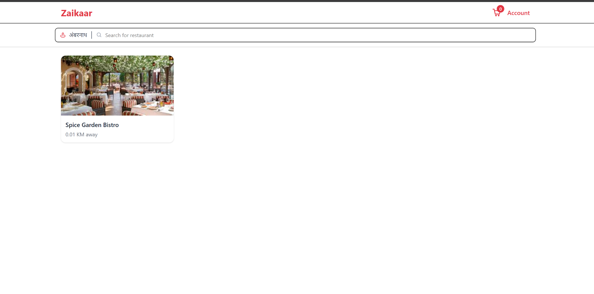

#### Restaurant Menu

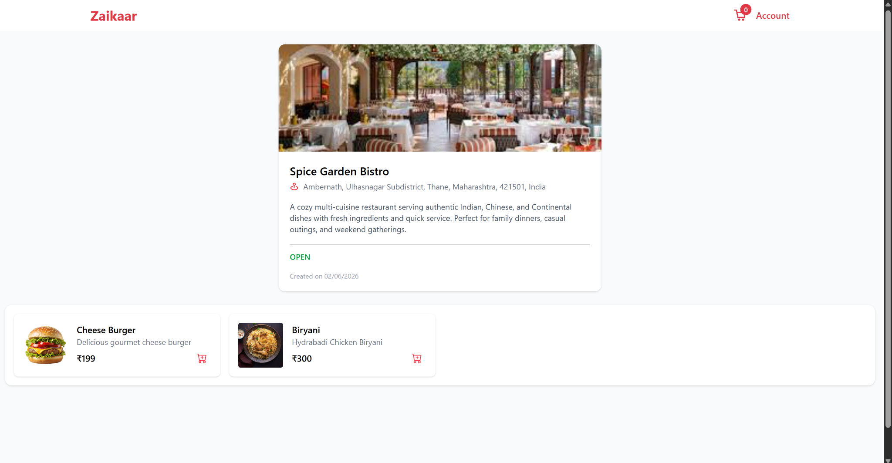

#### Cart

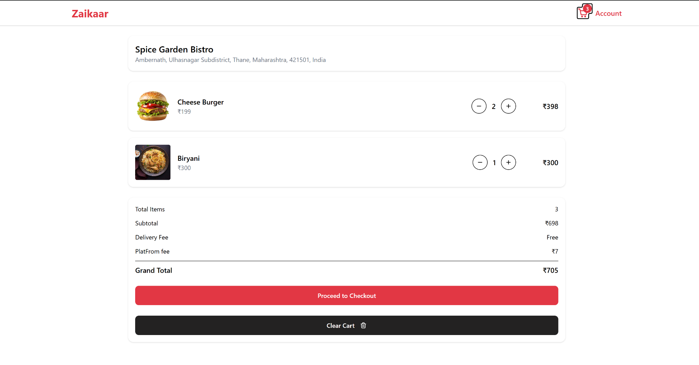

#### Checkout

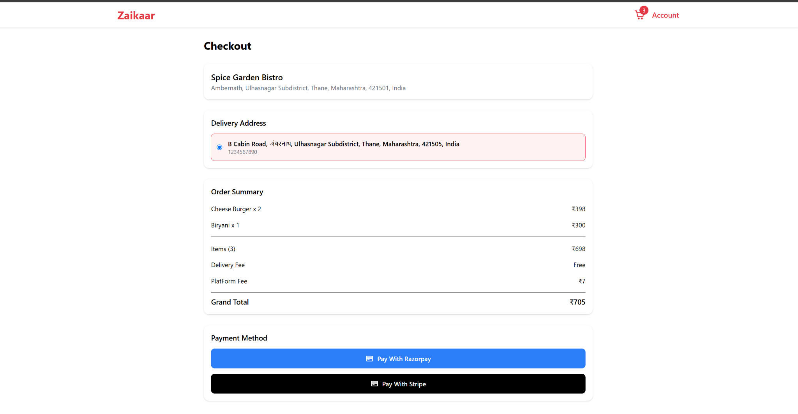

#### Order Details

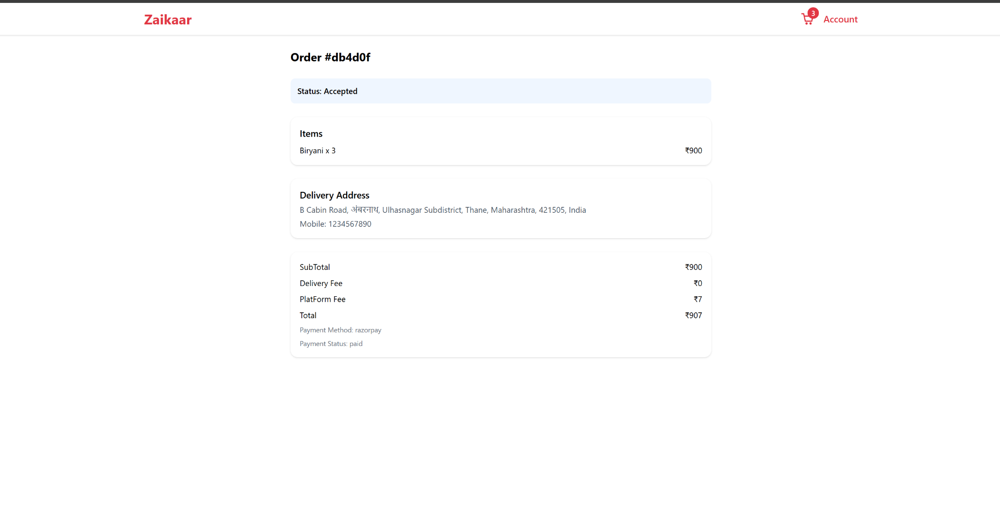

#### Order History

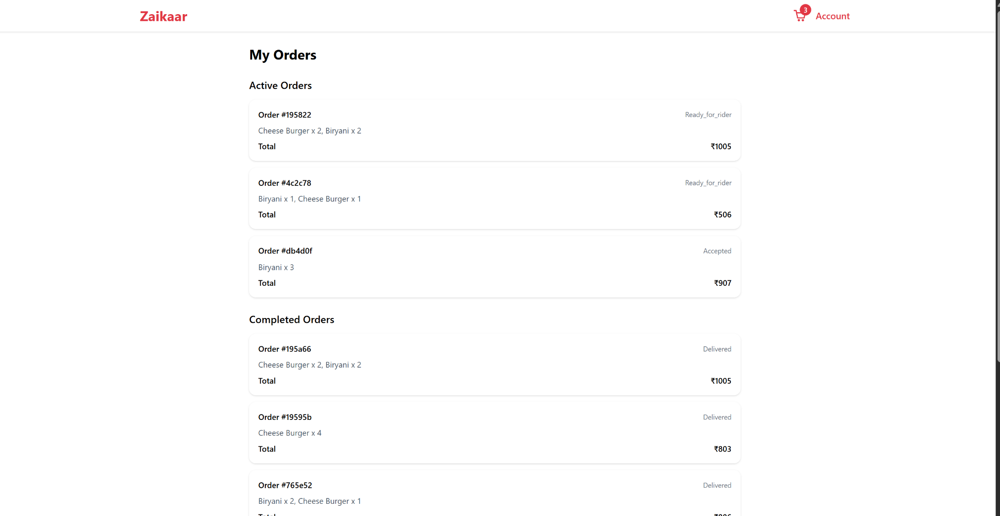

### Restaurant Owner

#### Dashboard

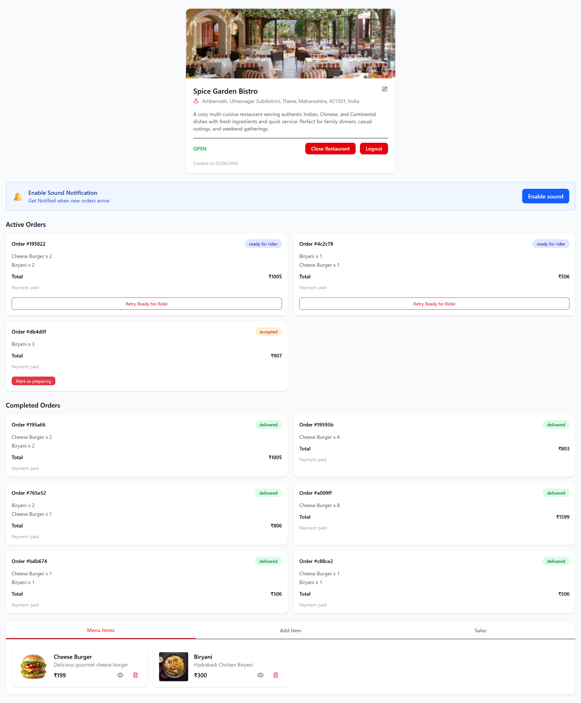

#### Add Menu Item

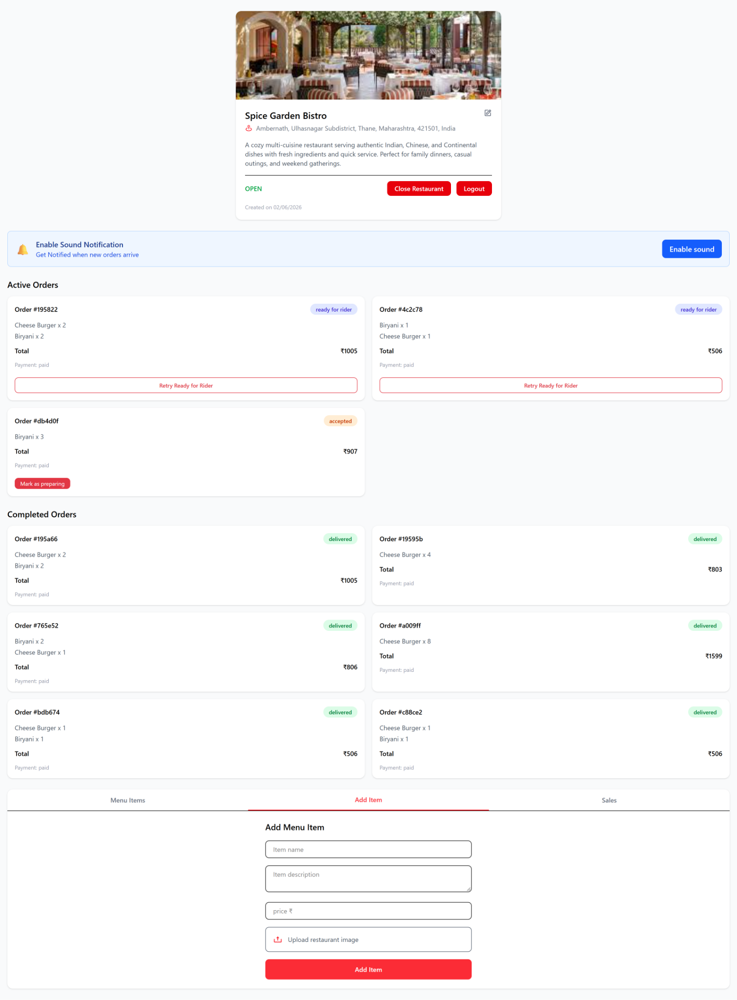

#### Sales & Earnings

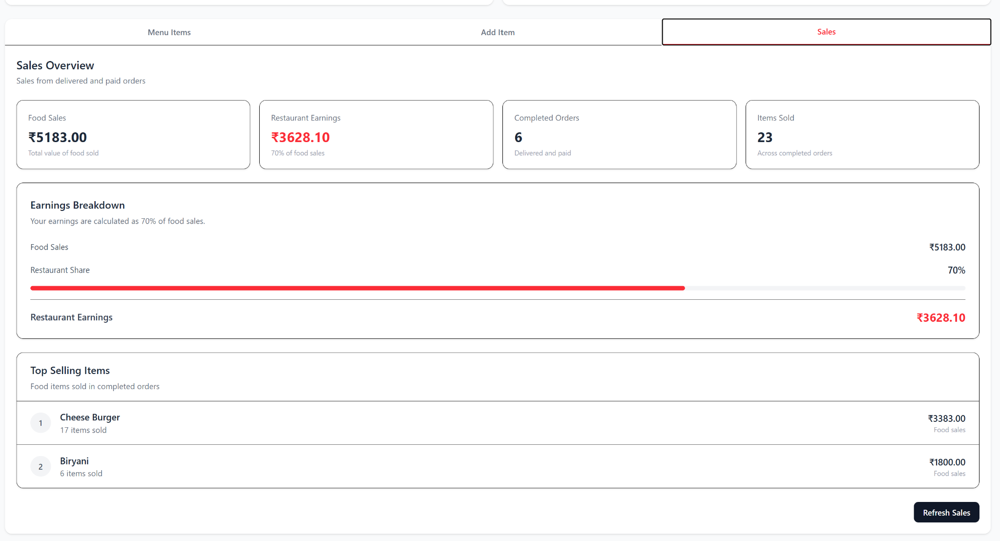

### Rider

#### Rider Dashboard

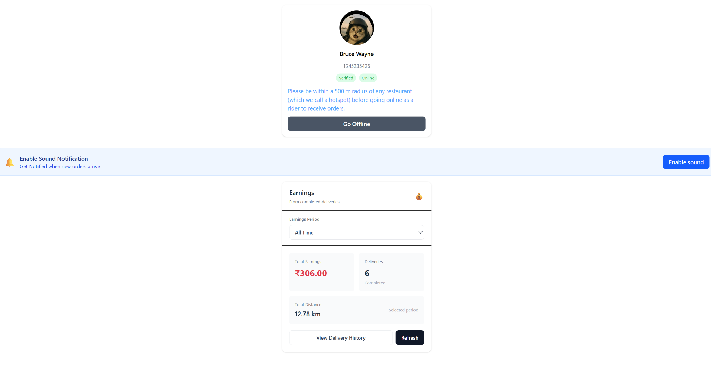

#### Incoming Orders

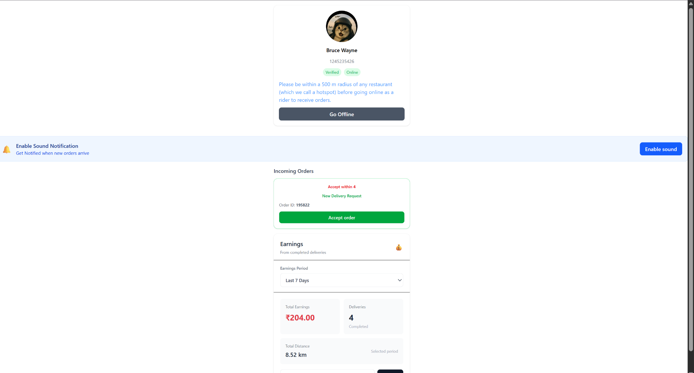

#### Current Delivery

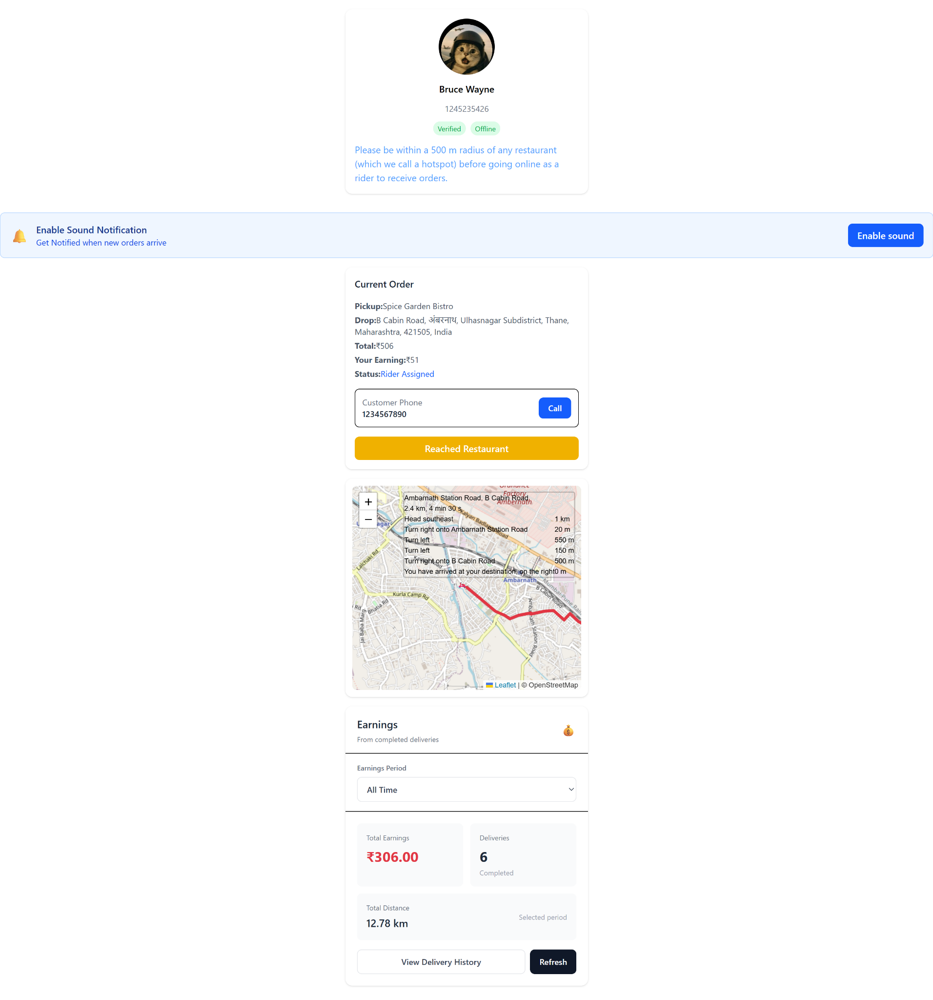

### Admin

#### Admin Dashboard


#### Rider Management


## 📁 Project Structure

```text
Zaikaar/
├── frontend/
│   └── .env.example
│
├── services/
│   ├── admin/
│   │   └── .env.example
│   ├── auth/
│   │   └── .env.example
│   ├── realtime/
│   │   └── .env.example
│   ├── restaurant/
│   │   └── .env.example
│   ├── rider/
│   │   └── .env.example
│   └── utils/
│       └── .env.example
│
├── Screenshots/
└── README.md
```

## 🚀 Running Locally

### 1. Clone the repository

```bash
git clone https://github.com/jaikishan1234/Zaikaar.git
cd Zaikaar
```

### 2. Configure environment variables

Example environment files are provided for the frontend and every backend service.

Copy the corresponding example file to `.env`:

```bash
# Frontend
cd frontend
cp .env.example .env
```

For a backend service:

```bash
cd services/restaurant
cp .env.example .env
```

Repeat this for the services you are running.

Then replace the placeholder values in each `.env` file with your own configuration.

### 3. Install dependencies

Frontend:

```bash
cd frontend
npm install
```

Backend services:

```bash
cd services/auth
npm install
```

Repeat for the other backend services.

### 4. Start the frontend

```bash
cd frontend
npm run dev
```

### 5. Start the backend services

Start each required backend service from its service directory:

```bash
npm run dev
```

The default local service ports are:

```text
Auth       → 5000
Restaurant → 5001
Utils      → 5002
Realtime   → 5004
Rider      → 5005
Admin      → 5006
```

Make sure MongoDB and RabbitMQ are available according to the environment configuration before starting services that depend on them.

## 🔐 Environment Variables

Zaikaar uses separate environment variables for the frontend and each backend service.

Example files are provided for all seven application components:

```text
frontend/.env.example

services/admin/.env.example
services/auth/.env.example
services/realtime/.env.example
services/restaurant/.env.example
services/rider/.env.example
services/utils/.env.example
```

### Frontend

The frontend example file contains:

```env
VITE_STRIPE_PUBLISHABLE_KEY=your_stripe_publishable_key
VITE_INTERNAL_SERVICE_KEY=your_internal_service_key
```

### Admin

```env
PORT=your_port
MONGO_URI=your_mongo_db_url
JWT_SEC=your_jwt_secret
DB_NAME=your_database_name
```

### Auth

```env
PORT=your_port
MONGO_URI=your_mongo_db_url
JWT_SEC=your_jwt_secret
GOOGLE_CLIENT_ID=your_google_client_id
GOOGLE_CLIENT_SECRET=your_google_client_secret
```

### Realtime

```env
PORT=your_port
JWT_SEC=your_jwt_secret
INTERNAL_SERVICE_KEY=your_internal_service_key
```

### Restaurant

```env
PORT=your_port
MONGO_URI=your_mongo_db_url
JWT_SEC=your_jwt_secret
UTILS_SERVICE=your_utils_service_url
REALTIME_SERVICE=your_realtime_service_url
INTERNAL_SERVICE_KEY=your_internal_service_key
RABBITMQ_URL=your_rabbitmq_url
PAYMENT_QUEUE=your_payment_queue
RIDER_QUEUE=your_rider_queue
ORDER_READY_QUEUE=your_order_ready_queue
```

### Rider

```env
PORT=your_port
MONGO_URI=your_mongo_db_url
JWT_SEC=your_jwt_secret
UTILS_SERVICE=your_utils_service_url
REALTIME_SERVICE=your_realtime_service_url
RESTAURANT_SERVICE=your_restaurant_service_url
INTERNAL_SERVICE_KEY=your_internal_service_key
RABBITMQ_URL=your_rabbitmq_url
RIDER_QUEUE=your_rider_queue
ORDER_READY_QUEUE=your_order_ready_queue
```

### Utils

```env
PORT=your_port
CLOUD_NAME=your_cloud_name
CLOUD_API_KEY=your_cloud_api_key
CLOUD_SECRET_KEY=your_cloud_secret_key
STRIPE_SECRET_KEY=your_stripe_secret_key
FRONTEND_URL=your_frontend_url
RESTAURANT_SERVICE=your_restaurant_service_url
INTERNAL_SERVICE_KEY=your_internal_service_key
RABBITMQ_URL=your_rabbitmq_url
PAYMENT_QUEUE=your_payment_queue
RAZORPAY_KEY_ID=your_razorpay_key_id
RAZORPAY_KEY_SECRET=your_razorpay_key_secret
```

> The `.env.example` files contain placeholders only. Replace them with your own values in local `.env` files.

### 🔒 Security

Never commit real `.env` files or production credentials to GitHub.

Do not expose:

- MongoDB credentials
- JWT secrets
- Google OAuth credentials
- Stripe secret keys
- Razorpay credentials
- Cloudinary credentials
- RabbitMQ credentials
- Internal service keys

Recommended `.gitignore` entries:

```gitignore
.env
.env.local
.env.development
.env.production
!.env.example
```

## 📦 Docker

Backend services can be built as Docker images from their respective service directories.

Example:

```bash
cd services/restaurant
docker build -t restaurant-service .
```

Run the image with the required environment configuration:

```bash
docker run --env-file .env -p 5001:5001 restaurant-service
```

Repeat the process for the other backend services using their respective ports and environment files.

## 🌐 Live Project

- **Frontend:** https://zaikaar.vercel.app/
- **GitHub:** https://github.com/jaikishan1234/Zaikaar
- **Demo Video:** https://drive.google.com/file/d/1dcA-v1WjZ4S5ZiTF8nABn_2w6dqGU9-A/view?usp=drive_link

## 👨‍💻 Author

**Jaikishan Nayak**

Full-Stack Developer focused on building production-oriented applications, distributed backend systems, and AI-powered software.

- GitHub: https://github.com/jaikishan1234

---

⭐ If you found Zaikaar interesting, feel free to explore the repository and the demo.
